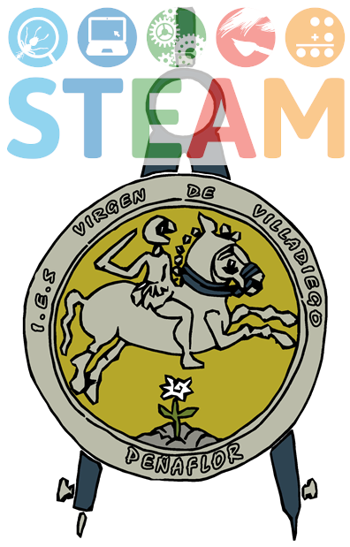

# VilladiegoSTEAM
Relación de trabajos realizados en el proyecto STEAM "Control y Robótica"

## [Peachímetro digital con Arduino](peachimetro/peachimetro.md)

## [Invernadero controlado por Arduino](invernadero/invernadero.md)

## [Jeringóforo impreso](jeringoforo/jeringoforo.md)

