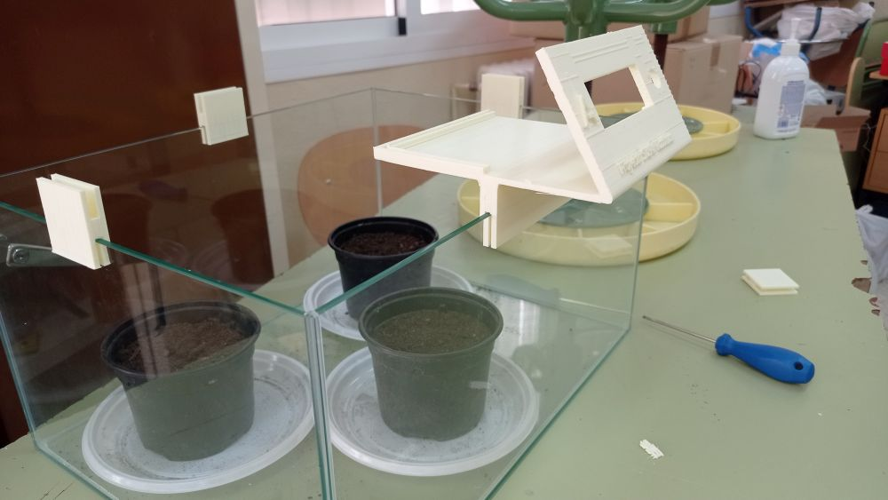
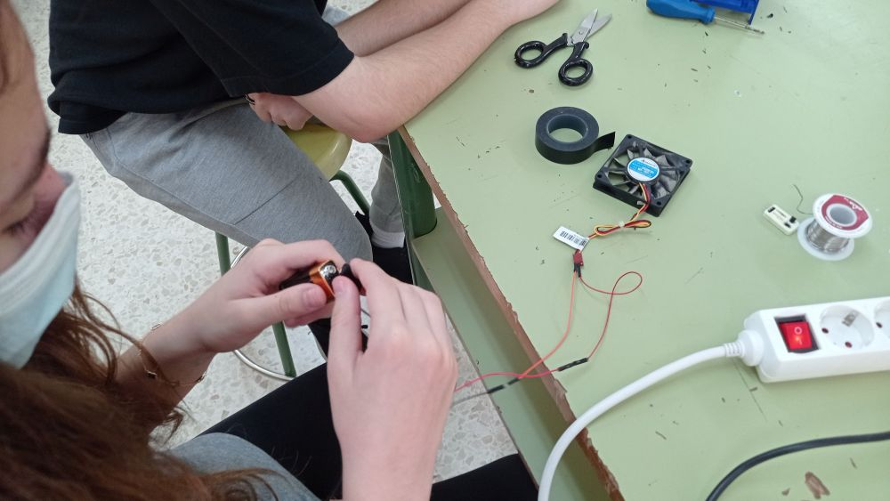

# Invernadero controlado por Arduino

## Motivación  

Hemos reciclado una vieja maqueta que teníamos por el laboratorio de Ciencias para construir un pequeño invernadero dotado de los siguientes elementos:

- Sensor de dióxido de carbono.
- Sensor de temperatura y humedad ambiental DHT11
- Sensor de humedad de la tierra
- Ventilador, que  nos permite la extracción y renovación del aire.  

---

## Componentes del montaje  

Se han utilizado los siguientes componentes electrónicos:
- [Placa Keyestudio UNO](KS0001_KEYESTUDIO.pdf)
- [Sensor de temperatura y humedad DHT11](DHT11-Technical-Data-Sheet-Translated-Version-1143054.pdf)
- [Display LCD I2C](I2C_1602_LCD_datasheet.pdf)
- [Sensor de humedad de la tierra KS0049](sensor-de-humedad-de-suelo-fc28.pdf)
- [Sensor de CO2](mh-z19b-co2-ver1_0_datasheet.pdf)
- Cables Dupont

## Modelos en 3D de las piezas  

Ha habido que fabricar algunas piezas con la impresora 3D para conseguir ensamblar las dos partes de vidrio de las que se compone el invernadero, así como para sostener la placa Arduino y todo el cableado.  

- **Unión de las dos partes del invernadero:**  
Esta pieza permite sujetar las dos estructuras fabricadas en vidrio, dejando un pequeño hueco para la entrada de aire.

  
[Descarga el archivo .stl](InvernaderoAux.stl)  

Así mismo, se ha diseñado una pieza para sostener todo el cableado, la placa Arduino y el display.  

- **Unidad de presentación**:  

  
[Descarga el archivo .stl](InvernaderoCaja1.stl)  

  
  

  
[Descarga el archivo .stl de las piezas 2 y 3](InvernaderoCaja2y3.stl)

## Imágenes 
  
  

### Unidad de presentación

  
  
  

### Sensores de humedad del suelo  
  

### Ventilador
  
  
  

## Código

Puedes consultar el código en [este enlace](codigo.md).

## Vídeo

[VOLVER](https://angelmicelti.github.io/VilladiegoSTEAM/)
