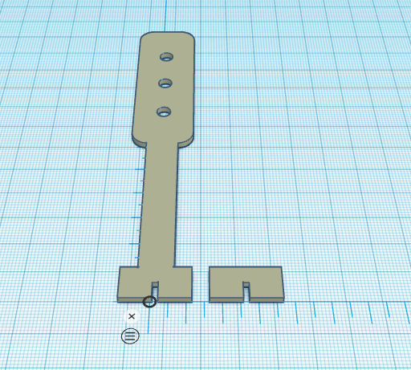

# Jeringóforo

Pese a los detractores que entre el mundo maker tiene el **semáforo**, éste constituye un elemento muy importante para acercar al alumnado al mundo de la tecnología.  

Diseñar y construir un semáforo, más en una impresora 3D, puede ser un reto fácilmente alcanzable y, sobre todo, motivador.  

## Modelo 3D

El modelo 3D que fue, finalmente, desarrollado por nuestro alumnado fue el siguiente:

cuyo modelo en 3D puede verse en [este enlace](jeringoforo.stl).