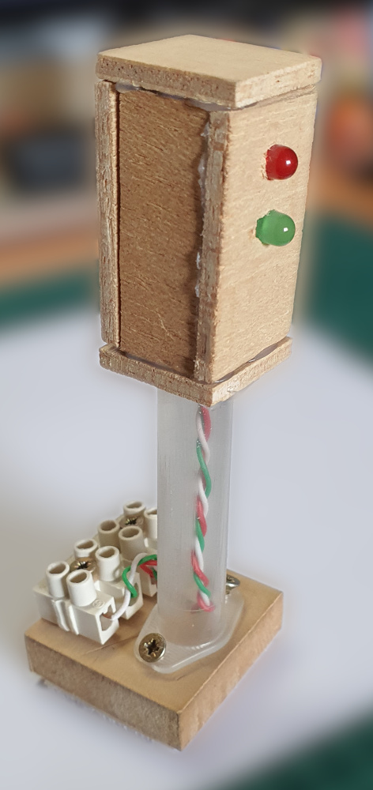
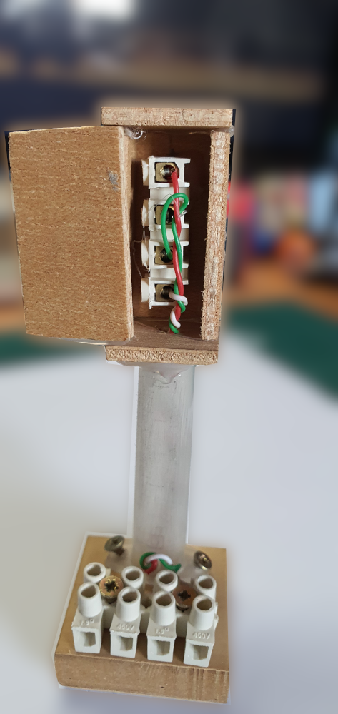
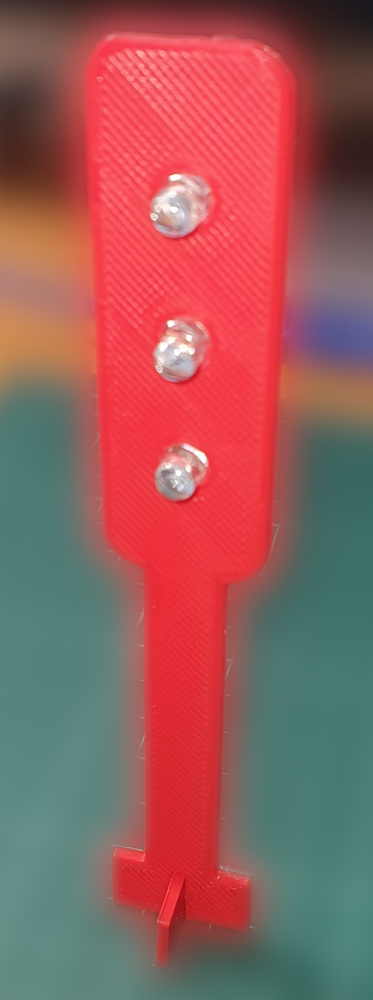
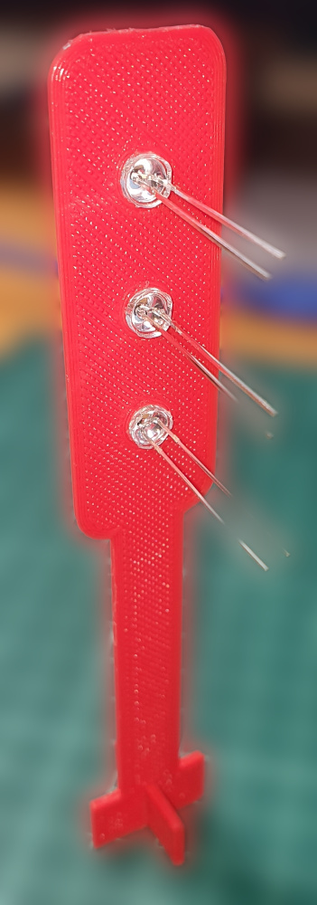
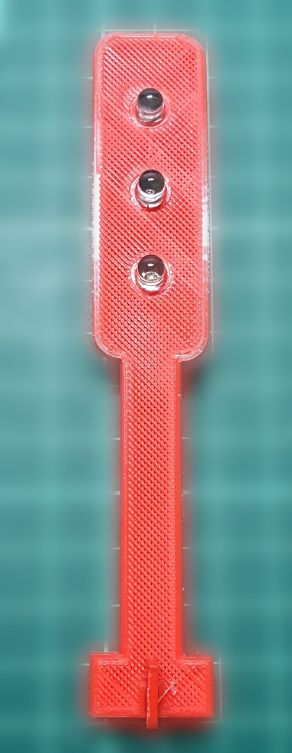
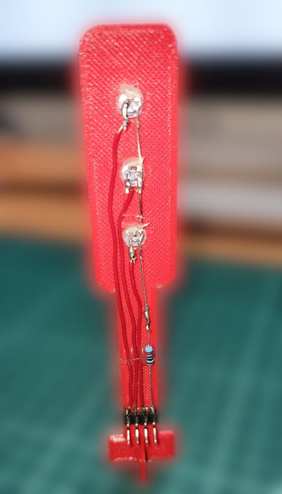
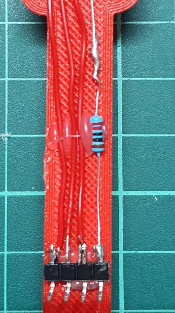

# Motivación

Pese a los detractores que entre el mundo maker tiene el **semáforo**, éste constituye un elemento muy importante para acercar al alumnado al mundo de la tecnología.  

Con nuestro alumnado acostumbramos a trabajar la construcción de un semáforo en 3º de E.S.O., al que llamamos **[jeringóforo](https://angelmicelti.github.io/PROY/JER/index.html)**, con dos luces, que podemos programar fácilmente con Arduino.  

Llevar esto a la impresión 3D de un dispositivo similar puede ser un reto fácilmente alcanzable y, sobre todo, motivador para el alumnado.  

  

## Modelo 3D
Se le propuso al alumnado que desarrollaran, en [TinkerCAD](https://www.tinkercad.com), un modelo que aproximara la forma del jeringóforo.

El modelo 3D que fue, finalmente, desarrollado por nuestros chicos y chicas fue el siguiente:

cuyo modelo en 3D puede verse en [este enlace](jeringoforo.stl).

## Montaje del modelo

Una vez que tenemos las piezas impresas, hay que realizar un pequeño ajuste, para que puedan encajar entre sí y, posteriormente, montarlas.  

Repasamos los orificios de los ledes, y los insertamos en los mismos.

A continuación, soldamos una resistencia a los cátodos de cada led (que están en común).  

Por último, soldamos los cables a unos pines acodados y, ¡ya está listo! Nuestro semáforo está funcionando...  

## Imágenes
### Piezas impresas en 3D

  

  

### Montaje del dispositivo

  

  

  

## Un programita para controlar el semáforo

Adjuntamos la imagen de un programa realizado con [Arduinoblocks](www.arduinoblocks.com) para el encendido de un semáforo cuyo ciclo de funcionamiento es de 10 segundos.  

Se utilizan funciones para el encendido de los respectivos ledes.

  

## Vídeo

[VOLVER](https://angelmicelti.github.io/VilladiegoSTEAM/)