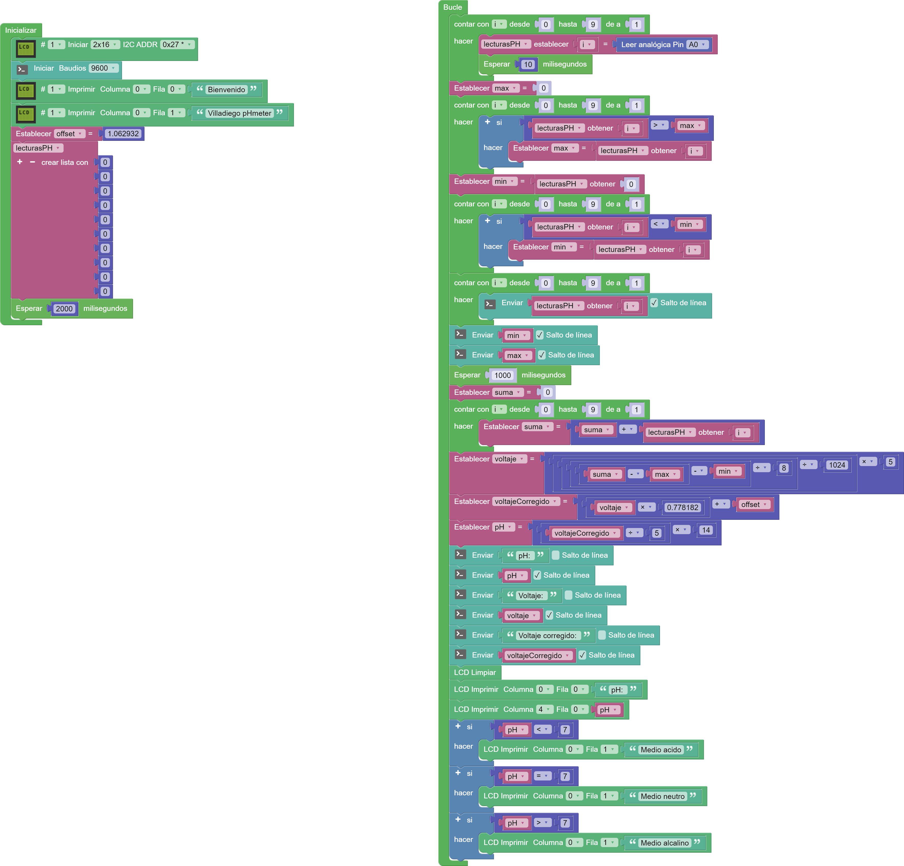

# Peachímetro digital  

## Motivación  

No es éste un proyecto muy frecuente que se vea por las webs de iniciación a la programación con Arduino.  

Nuestro alumnado seleccionó este proyecto como una estrategia de "aprendizaje servicio", para ayudar a los compañeros de 4º de E.S.O. en la determinación del pH de las disoluciones con las que trabajan en el laboratorio de ciencias.  

Se adquirió el sensor de pH y, con bastante paciencia, se ha hecho un trabajo de calibración, utilizando tres soluciones patrón de pH conocido.  

---
## Componentes del montaje. 

Se han utilizado los siguientes componentes electrónicos:
- [Placa Keyestudio UNO](KS0001_KEYESTUDIO.pdf)
- [Sensor de pH SKU SEN0161](sen0161_dataSheet.pdf)
- [Display LCD I2C](I2C_1602_LCD_datasheet.pdf)
- [Sensor de temperatura y humedad DHT11](DHT11-drobotics.pdf)
- [Sensor de humedad de la tierra KS0049](https://wiki.keyestudio.com/index.php/Ks0049_keyestudio_Soil_Humidity_Sensor)
- Cables Dupont

---
## Modelos en 3D de las piezas

#### [Caja](CajaPhmetro.stl)

#### [Tapadera](TapaPhmetro.stl)

#### [Portapilas](PortapilasPhmetro.stl)

---

## Imágenes   

---

## Código  

[VOLVER](https://angelmicelti.github.io/VilladiegoSTEAM/)
